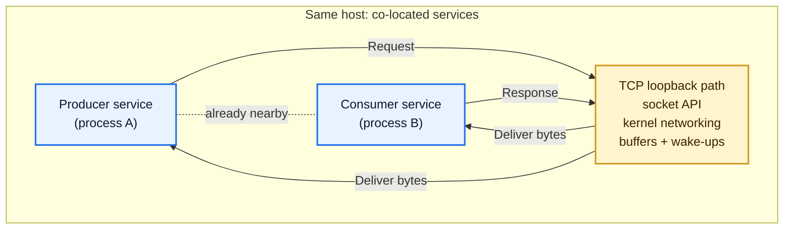
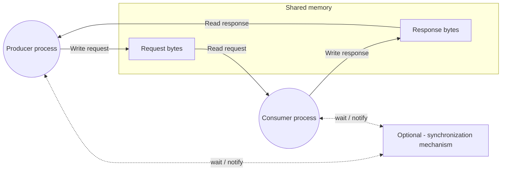
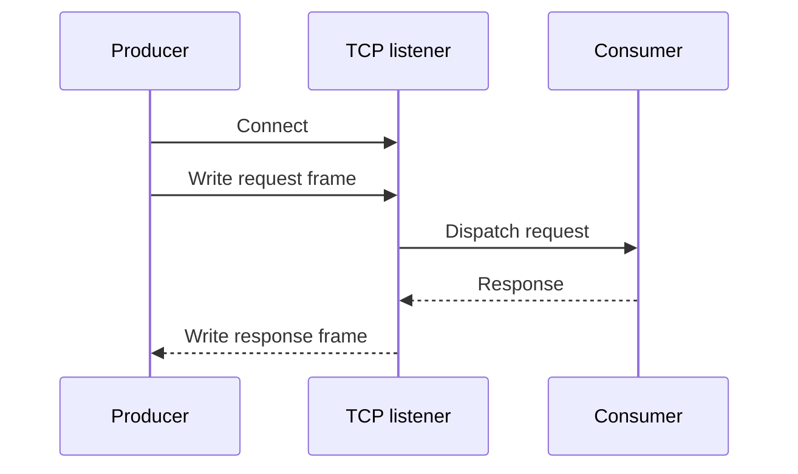
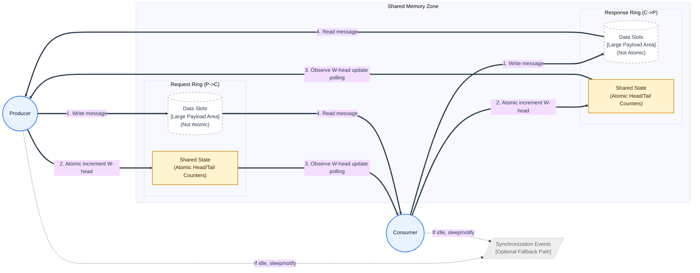
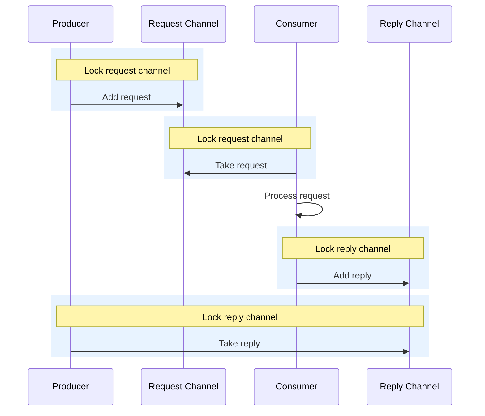

# Low-latency messaging with shared memory

## The problem

A producer and a consumer need to exchange small request/reply messages as quickly as possible. In many systems the default answer is TCP, even when both processes are running on the same machine.

TCP is a great general-purpose transport. It works across machines and behaves consistently with the rest of the networking stack.

When both processes are co-located, though, TCP can be more machinery than the problem needs. The message still goes through sockets, kernel networking paths, buffers, framing, connection handling, and wake-ups designed for communication between machines. If the only requirement is "process A and process B on the same host need to exchange messages", that extra work adds latency.

## What is shared memory?

Shared memory lets two processes map the same region of memory into their own address spaces. Rather than sending bytes through the networking stack, one process writes bytes into that shared region and the other process reads them from the same region.

The important distinction is that shared memory is the data path. The synchronization mechanism is not another messaging layer; it carries no request or response payload. It simply lets a process avoid burning CPU while it waits for something new to appear in shared memory.

Different shared-memory designs choose different synchronization mechanisms. Some use locks and events. Others use sequence counters and only fall back to events when a reader has nothing to do.

## Baseline: TCP loopback

A typical TCP loopback request/reply implementation opens a socket, writes a length-prefixed request, waits for the response, then closes or reuses the connection.

This is simple and portable, and it remains the right answer when the producer and consumer may run on different machines. In the co-located case, it gives us a useful baseline for how much latency the TCP path adds.

## Solution: ring-buffer shared memory

A fast shared-memory design uses a ring buffer: a fixed-size circular queue stored in shared memory. For request/reply messaging, a common shape is two rings:

1. A **request ring** written by the producer and read by the consumer.
1. A **response ring** written by the consumer and read by the producer.

Each ring has a small amount of shared state that says where the next write and next read should happen. A writer copies a message into the next free slot and advances the write position. A reader checks whether a new slot is available, reads it, and advances the read position. This shared state is critical: it avoids torn reads, as writing a large message to a slot might take multiple CPU cycles, but advancing the write position is an atomic operation which happens after the message is fully written to the slot (guaranteed when using memory barriers).

This is optimized for latency because the hot path is mostly memory reads, memory writes, and counter updates. If the reader is already active, it can observe the new write without waiting for the operating system to wake it. If it has nothing to read, it can wait on a synchronization event instead of spinning forever.

## Pitfalls of the ring-buffer approach

Ring buffers are fast, but the speed comes from making the protocol more explicit.

| Pitfall | Why it matters |
| -- | -- |
| Single-producer/single-consumer shape | A simple ring pair works best when exactly one process writes each ring and exactly one process reads it. |
| Fixed capacity | Slot count and maximum message size are chosen up front. Too small and writers wait; too large and memory is wasted. |
| CPU tradeoff | Spinning can reduce latency, but it uses CPU while waiting. Sleeping saves CPU, but adds wake-up latency. |
| Recovery | If one process exits while another is active, the shared state may need an explicit reset strategy. |
| Operational coupling | Both processes need to agree on layout, message framing, versioning, and object names. |

If the application needs ultra-low latency and has a clean single-producer/single-consumer topology, those tradeoffs can be worth it. If the topology is messier, or if simplicity matters more than the absolute lowest latency, there is another option.

## Alternative: synchronized shared memory

A synchronized shared-memory design keeps shared memory as the data path, but replaces the ring protocol with simple channels protected by cross-process synchronization.

The key difference is that this is asynchronous request/reply: the request and reply are linked by a correlation ID, not by holding a lock for the whole request/reply cycle. A producer writes a request, releases the request channel, and then waits for a reply with the same ID. The consumer can read the request later, process it, and publish the matching reply independently.

It uses:

1. A shared request channel for pending requests.
2. A shared reply channel for completed replies.
3. A lock around each channel while a process adds or removes an item.
4. Events or semaphores so processes can sleep while waiting for work.

This commonly uses named mutexes or semaphores for the channel locks, plus events or semaphores for the request-ready and reply-ready notifications.

This fixes some of the ring-buffer pitfalls by moving complexity into familiar synchronization primitives. There are no ring positions to manage, no slot rotation, and less need to design a strict single-producer/single-consumer topology up front. Multiple producers can add requests to the same channel and wait for their own correlated replies.

The correlation ID is important on the reply side. A shared reply channel must keep a reply available until the producer waiting for that ID reads it; otherwise one producer could accidentally consume another producer's response.

The cost is that every channel access has to wait for the relevant lock, and the reply side needs sensible timeout and cleanup rules for replies that are never read. That makes the design easier to reason about than a ring buffer, but less optimized for the absolute lowest latency. It is a useful alternative when shared memory is attractive, but the ring-buffer protocol is more complexity than the latency budget justifies.

## Testing each implementation

I measured three transports in the same co-located request/reply scenario:

1. **TCP loopback** over `127.0.0.1`.
1. **Ring-buffer shared memory** using one shared region containing a request ring and a response ring.
1. **Synchronized shared memory** using shared request/reply regions, locks, request/reply events, and correlation IDs.

The producer sent the same 32-byte payload once per second through each transport. The consumer immediately echoed the request back as a response. The producer timestamped each request before sending it, received the response, and calculated round-trip time (RTT).

The implementation used length-prefixed JSON frames for all three transports. The shared-memory variants used Windows named shared-memory and wait-handle primitives; the ring-buffer variant used a fixed slot count and briefly spun before falling back to an event wait.

Metrics were logged in five-second windows, so each window contains five requests per transport. The first window includes process startup and object creation noise, so the summary below uses the seven steady-state windows that follow it.

## Results

| Transport | Mean RTT window average (ms) | Best observed min (ms) | Worst observed max (ms) | Compared with TCP loopback |
| -- | --: | --: | --: | -- |
| TCP loopback | 1.62 | 1.10 | 3.16 | Baseline |
| Ring-buffer shared memory | 0.39 | 0.22 | 0.65 | ~4.2x lower RTT |
| Synchronized shared memory | 0.64 | 0.41 | 1.32 | ~2.5x lower RTT |

The ring buffer produced the lowest steady-state RTT because it keeps request and response bytes in fixed shared slots and avoids the lock on normal reads and writes. The synchronized shared-memory channel was slower, but still substantially faster than TCP loopback while using a simpler request/reply protocol.

## Comparison

| Feature | Ring-buffer shared memory | Synchronized shared memory |
| -- | -- | -- |
| Best for... | Absolute maximum speed (lowest latency). | Simplicity and having multiple senders. |
| Speed | Ultra-fast (no waiting for locks). | Fast, but each channel access may wait for a lock. |
| CPU Usage | Can be higher if it polls/spins for new data. | Low (goes to sleep when waiting). |
| Participants | Strictly 1-to-1 communication. | Many-to-1 (multiple senders can queue requests). |
| If it crashes... | Hard to clean up the messy state. | Simpler, unless someone crashes while holding a lock or leaves unmatched replies. |

## Limitations

Shared memory is not a general replacement for TCP or a message broker. It is a good fit when the processes are intentionally co-located and the latency budget is tight, but it comes with operational constraints:

1. It only works on the same machine.
1. It does not provide routing, durability, retries, discovery, or load balancing.
1. Both sides need to agree on frame format, capacity, object names, lifecycle, and security permissions.
1. Versioning is tighter because producer and consumer share a low-level protocol.
1. Stale shared memory state needs a reset strategy after crashes or unclean shutdowns.

For co-located services that exchange small, high-frequency messages, those tradeoffs can be worth it. For anything that needs cross-machine communication, independent deployment, or durable delivery, TCP or a broker is still the safer default.
