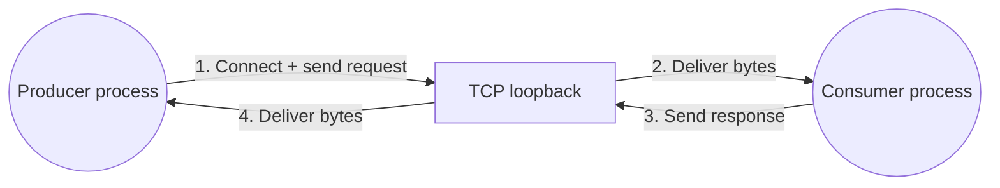
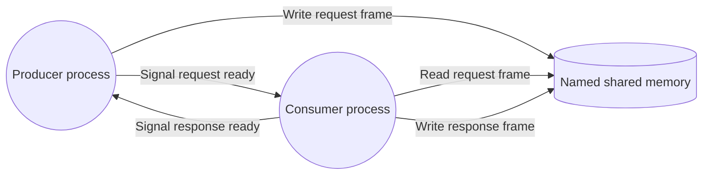
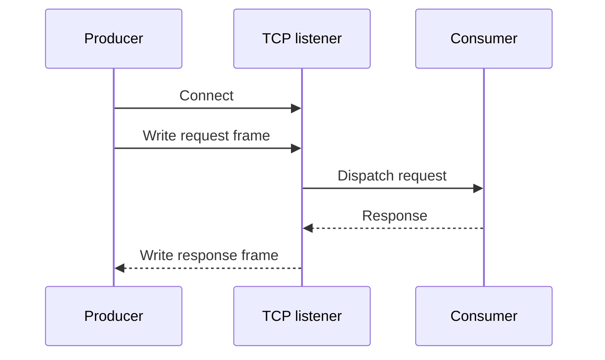
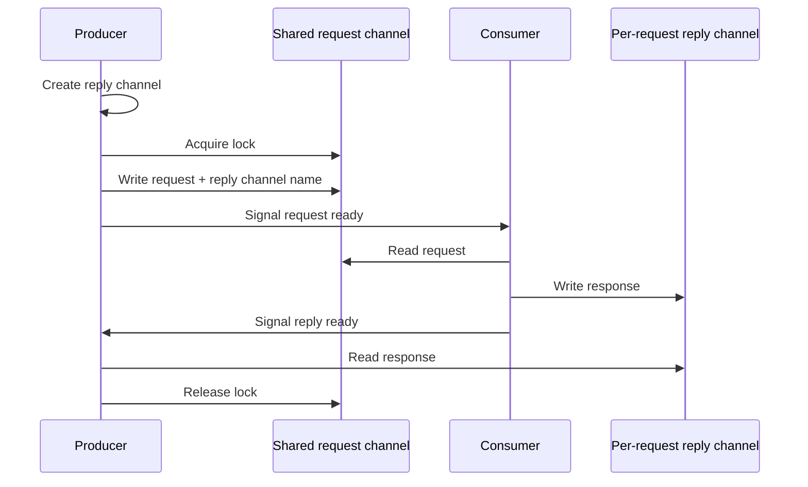
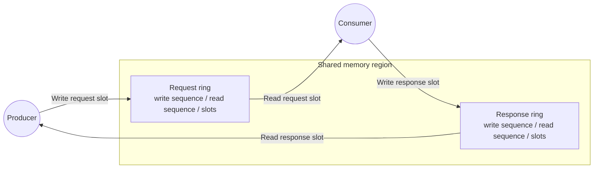

# Low-latency messaging with shared memory

## The problem

A producer and a consumer need to exchange small request/reply messages as quickly as possible. In many systems the default answer is TCP, even when both processes are running on the same machine.

TCP is a great general-purpose transport. It works across machines and behaves consistently with the rest of the networking stack. However, when both processes are co-located, TCP is also doing work that may not be useful for the problem.

The message still goes through sockets, kernel networking paths, buffers, framing, connection handling, and wake-ups designed for communication between machines.

If the only requirement is "process A and process B on the same host need to exchange messages", that extra work adds latency.

## What is shared memory?

Shared memory lets two processes map the same region of memory into their own address spaces. Instead of sending bytes to the kernel networking stack and asking it to deliver them to another process, one process writes bytes into the shared region and signals the other process that data is ready.

Most platforms expose shared memory through memory-mapped files. The shared region is only part of the solution though. Processes also need a synchronization mechanism so the reader knows when a complete message is available and the writer knows when it can safely reuse memory.

## Baseline: TCP loopback

A typical TCP request/reply implementation opens a socket, writes a length-prefixed request, waits for the response, then closes or reuses the connection.

This is simple and portable, and it is the right answer when the producer and consumer may run on different machines. In the co-located case, it gives us a useful baseline for how much latency the networking path adds.

## Solution 1: synchronized shared memory

The simplest shared-memory request/reply design is a single shared request channel protected by a lock. It uses:

1. A named shared-memory region as the request channel.
1. A named mutex, lock, or semaphore to ensure only one producer writes to the request channel at a time.
1. A ready signal to wake the consumer when a request has been written.
1. A per-request reply channel and reply signal so the consumer can send the response back to the waiting producer.

The important detail is that the lock is held until the response returns. That makes the transport easy to reason about: there is only one in-flight request on the shared request channel, and each request has an unambiguous reply channel.

The tradeoff is that the lock serializes complete request/reply cycles. This removes most of the loopback networking overhead, but it does not try to be a high-concurrency transport.

## Solution 2: ring-buffer shared memory

A faster shared-memory design uses fixed-size rings. One common request/reply shape is a pair of single-producer/single-consumer rings:

1. A **request ring** written by the producer and read by the consumer.
1. A **response ring** written by the consumer and read by the producer.

Each ring has a write sequence, a read sequence, and a fixed number of slots. A writer copies a frame into the next free slot, advances the write sequence, and signals that an item is available. A reader checks whether the read sequence has caught up with the write sequence; if not, it reads the next slot and advances the read sequence.

This avoids a mutex on the hot path. The ring itself provides back-pressure: if the writer catches up to the reader and all slots are full, the writer waits for a slot to become free. Implementations often spin briefly before waiting on an operating-system event, which can reduce wake-up latency at the cost of some CPU.

The constraint is the concurrency model. A single request ring and response ring are naturally single-producer/single-consumer. To support multiple producers, you would normally shard by producer, allocate one ring pair per producer, or add a separate multiplexing protocol.

## How this was tested

I measured three transports in the same co-located request/reply scenario:

1. **TCP loopback** over `127.0.0.1`.
1. **Synchronized shared memory** using a shared request region, a named mutex, request/response events, and a per-request reply region.
1. **Ring-buffer shared memory** using one shared region containing a request ring and a response ring.

The producer sent the same 32-byte payload once per second through each transport. The consumer immediately echoed the request back as a response. The producer timestamped each request before sending it, received the response, and calculated round-trip time (RTT).

The implementation used length-prefixed JSON frames for all three transports. The shared-memory variants used Windows named shared-memory and wait-handle primitives; the ring-buffer variant used a fixed slot count and briefly spun before falling back to an event wait.

Metrics were logged in five-second windows, so each window contains five requests per transport. The first window includes process startup and object creation noise, so the summary below uses the seven steady-state windows that follow it.

## Results

| Transport | Mean RTT window average (ms) | Best observed min (ms) | Worst observed max (ms) | Compared with TCP |
| -- | --: | --: | --: | -- |
| TCP loopback | 1.62 | 1.10 | 3.16 | Baseline |
| Synchronized shared memory | 0.64 | 0.41 | 1.32 | ~2.5x lower RTT |
| Ring-buffer shared memory | 0.39 | 0.22 | 0.65 | ~4.2x lower RTT |

The simple shared-memory channel cuts steady-state RTT substantially because it avoids the loopback network path. The ring buffer improves further by keeping the request and response paths in fixed shared slots and avoiding a mutex during normal reads and writes.

## Limitations

Shared memory is not a general replacement for TCP or a message broker. It is a good fit when the processes are intentionally co-located and the latency budget is tight, but it comes with operational constraints:

1. It only works on the same machine.
1. It does not provide routing, durability, retries, discovery, or load balancing.
1. Both sides need to agree on frame format, capacity, object names, lifecycle, and security permissions.
1. Versioning is tighter because producer and consumer share a low-level protocol.
1. Stale shared memory state needs a reset strategy after crashes or unclean shutdowns.

For co-located services that exchange small, high-frequency messages, those tradeoffs can be worth it. For anything that needs cross-machine communication, independent deployment, or durable delivery, TCP or a broker is still the safer default.
